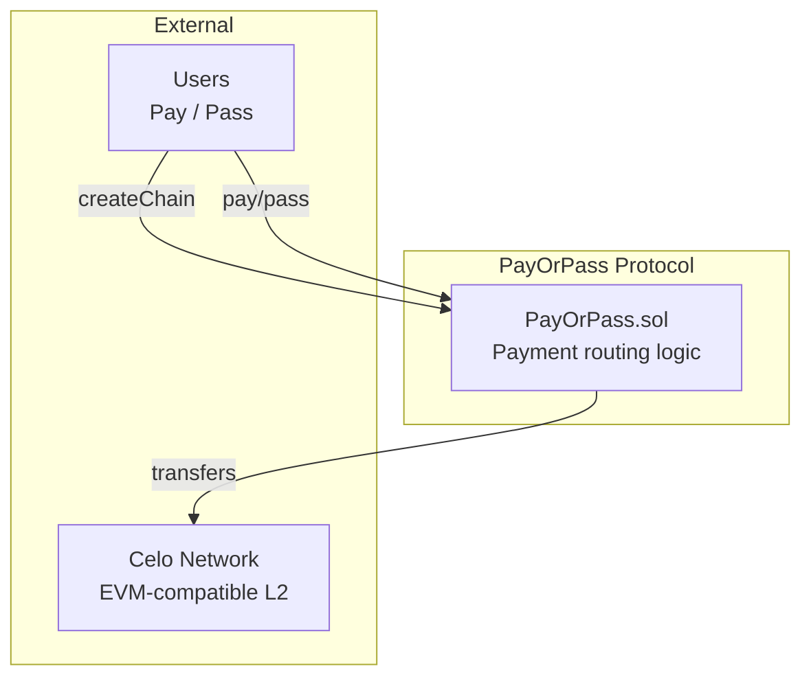

# PayOrPass — Smart Contracts

<div align="center">

[](https://soliditylang.org)
[](https://hardhat.org)
[](https://celo.org)
[](https://github.com/Richiey1/pay-or-pass)

Solidity smart contracts for the PayOrPass social payment game on Celo. Conditional escrow payments with time-based, manual, and oracle-triggered execution.

</div>

---

## 🏗️ Architecture



---

## 📄 Contract Overview

### PayOrPass.sol

Core social payment game contract. Implements a chain-based payment router where:

- **Create Chain**: Start a payment chain with initial amount.
- **Pay**: Absorb the cost and end the chain.  
- **Pass**: Forward increased amount to another user (20% multiplier).

**Key Functions:**

```solidity
function createChain(address token, uint256 amount) 
    external 
    payable 
    returns (uint256 chainId)
```
Creates a new payment chain. For native token, use `address(0)` and match `msg.value`.

```solidity
function pay(uint256 chainId) external payable nonReentrant
```
Pays the current amount to end the chain. Must match exact amount.

```solidity  
function pass(uint256 chainId, address to) external nonReentrant
```
Passes to another user, increasing amount by multiplier.

**State Variables:**
- `defaultTimeout` — Seconds before auto-pay (default: 1 hour)
- `defaultMultiplier` — Pass multiplier in basis points (default: 12000 = 120%)
- `supportedTokens` — Mapping of allowed token addresses

**Events:**
- `ChainCreated` — New chain started
- `PayAction` — Chain ended via payment
- `PassAction` — Amount forwarded to another user  
- `ChainTimedOut` — Auto-pay triggered

---

## 🔐 Security Features

- **ReentrancyGuard** on all state-changing functions.
- **Input validation** (zero address, amounts, timeouts).
- **Safe transfer patterns** with revert handling.
- **Timeout enforcement** prevents indefinite stalling.

---

## 🧪 Testing

```bash
# Run all comprehensive unit tests
npx hardhat test

# Compile
npx hardhat compile
```

---

## 🚀 Deployment

### Celo Alfajores (Testnet)

```bash
npx hardhat run scripts/deploy.ts --network celoAlfajores
```

### Local Development

```bash
npx hardhat node
npx hardhat run scripts/deploy.ts --network localhost
```

---

## 📊 Key Parameters

| Parameter | Default | Description |
|-----------|---------|-------------|
| Timeout | 1 hour | Auto-pay if no action |
| Multiplier | 120% | Pass amount increase |

---

## 🔗 Resources

- [Solidity Docs](https://docs.soliditylang.org)
- [Hardhat](https://hardhat.org)
- [Celo Developer Docs](https://docs.celo.org)

---

### License

MIT © PayOrPass Protocol
